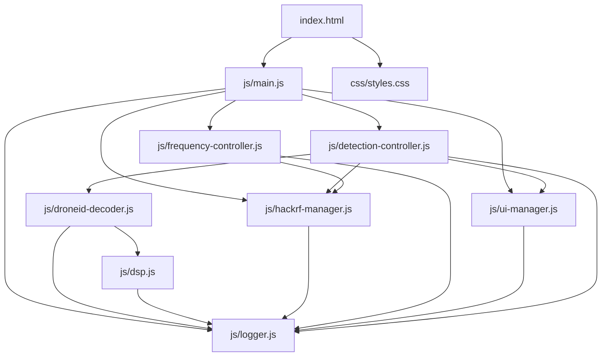
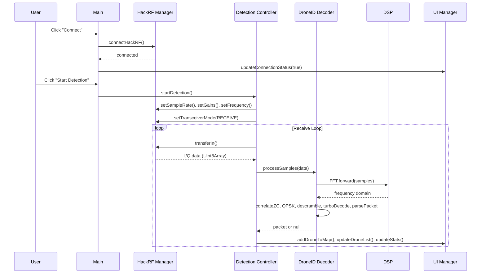

# Design Document: HackRF Drone Detector Refactor

## Overview

This design describes the refactoring of the monolithic `harf.html` (~1445 lines) into a modular ES module architecture. The original file contains all HTML, CSS, and JavaScript in a single file. The refactored application splits this into 10 files organized by concern: an HTML entry point, an external CSS stylesheet, and 8 JavaScript ES modules (logger, hackrf-manager, frequency-controller, dsp, droneid-decoder, detection-controller, ui-manager, main).

Every module adds detailed logging at operation boundaries using a centralized logger. The refactored application must be functionally equivalent to the original — same WebUSB workflow, same DSP pipeline, same packet parsing, same UI behavior.

### Key Design Decisions

1. **No build tools** — The application uses native ES modules (`<script type="module">`) loaded directly by the browser. No bundler, transpiler, or package manager is needed.
2. **Singleton pattern for stateful modules** — Logger, HackRF Manager, and Detection Controller export singleton instances since the app manages a single device connection and scanning session.
3. **Class exports for DSP/Decoder** — Complex, FFT, ZadoffChu, GoldSequence, and DroneIDDecoder are exported as classes, matching the original OOP structure.
4. **Logger dependency injection** — Each module imports the logger and passes its module name as a tag, enabling per-module log filtering.
5. **Leaflet remains a CDN dependency** — Leaflet.js and its CSS continue to load from unpkg CDN via `<link>` and `<script>` tags in `index.html`, since the original uses this approach and there's no npm setup.

## Architecture

```
┌─────────────────────────────────────────────────────┐
│                   index.html                         │
│  <link css/styles.css>                               │
│  <script src="leaflet.js">                           │
│  <script type="module" src="js/main.js">             │
└──────────────────────┬──────────────────────────────┘
                       │
                  js/main.js
                       │
       ┌───────────────┼───────────────────┐
       │               │                   │
  js/logger.js    js/ui-manager.js    js/hackrf-manager.js
       │               │                   │
       │          js/frequency-controller.js│
       │               │                   │
       │          js/detection-controller.js│
       │               │                   │
       │          js/droneid-decoder.js     │
       │               │                   │
       │            js/dsp.js              │
       │                                   │
       └───────────────────────────────────┘
```

### Module Dependency Graph



### Data Flow



## Components and Interfaces

### js/logger.js

```typescript
// Log levels (numeric for comparison)
enum LogLevel { DEBUG = 0, INFO = 1, WARNING = 2, ERROR = 3, SUCCESS = 4 }

class Logger {
  minLevel: LogLevel;
  
  constructor(minLevel?: LogLevel);
  setLevel(level: LogLevel): void;
  debug(module: string, message: string, data?: any): void;
  info(module: string, message: string, data?: any): void;
  warning(module: string, message: string, data?: any): void;
  error(module: string, message: string, data?: any): void;
  success(module: string, message: string, data?: any): void;
}

export default new Logger(); // singleton
export { LogLevel };
```

Each log method:
- Prepends `[HH:MM:SS.mmm] [LEVEL] [ModuleName]` to the message
- Appends a DOM element to `#logConsole` with CSS class matching the level
- Calls the corresponding `console.*` method
- Skips if level < minLevel

### js/hackrf-manager.js

```typescript
// USB constants exported for reference
export const HACKRF_VENDOR_ID = 0x1d50;
export const HACKRF_PRODUCT_ID = 0x6089;
// ... all vendor request codes, transceiver modes, buffer size

class HackRFManager {
  device: USBDevice | null;
  isConnected: boolean;

  async connectHackRF(): Promise<void>;
  async disconnectHackRF(): Promise<void>;
  async getBoardInfo(): Promise<void>;
  async setFrequency(freqHz: number): Promise<void>;
  async setSampleRate(rateHz: number): Promise<void>;
  async setLNAGain(gain: number): Promise<void>;
  async setVGAGain(gain: number): Promise<void>;
  async setTransceiverMode(mode: number): Promise<void>;
  async transferIn(endpoint: number, length: number): Promise<USBInTransferResult>;
}

export default new HackRFManager(); // singleton
```

### js/frequency-controller.js

```typescript
// Frequency constants
export const DRONEID_FREQ_2_4 = 2437000000;
export const DRONEID_FREQ_5_8 = 5200000000;
export const DRONEID_FREQ_1_4 = 1420000000;

class FrequencyController {
  currentBand: string;

  selectBand(band: string): void;
  getFrequencyForBand(band: string): number;
  initSliderListeners(): void;
  getCustomFrequency(): number;
  getLNAGain(): number;
  getVGAGain(): number;
  getSampleRate(): number;
}

export default new FrequencyController();
```

### js/dsp.js

```typescript
export class Complex {
  re: number;
  im: number;
  constructor(re?: number, im?: number);
  add(other: Complex): Complex;
  sub(other: Complex): Complex;
  mul(other: Complex): Complex;
  magnitude(): number;
  phase(): number;
  conjugate(): Complex;
}

export class FFT {
  size: number;
  bitReversedIndices: number[];
  constructor(size: number);
  computeBitReversedIndices(): number[];
  forward(input: Complex[]): Complex[];
}

export class ZadoffChu {
  static generate(root: number, length: number): Complex[];
}

export class GoldSequence {
  lfsr1: number;
  lfsr2: number;
  constructor(seed: number);
  next(): number;
  generate(length: number): number[];
}
```

### js/droneid-decoder.js

```typescript
import { Complex, FFT, ZadoffChu, GoldSequence } from './dsp.js';

// OUI constants
export const DJI_OUI = [0x26, 0x37, 0x12];
export const REMOTE_ID_OUI = [0x6a, 0x5c, 0x35];

// DSP constants
export const FFT_SIZE = 2048;
export const CYCLE_PREFIX_LENGTH = 128;
export const ZC_ROOT_1 = 600;
export const ZC_ROOT_2 = 147;

export class DroneIDDecoder {
  fft: FFT;
  zcSeq1: Complex[];
  zcSeq2: Complex[];
  frameBuffer: Complex[];
  state: string;

  constructor();
  processSamples(iqData: Uint8Array): Packet | null;
  processFrame(samples: Complex[]): Packet | null;
  correlateZC(fftOutput: Complex[], zcSequence: Complex[]): number[];
  extractSubcarriers(fftOutput: Complex[]): Complex[];
  qpskDemodulate(subcarriers: Complex[]): number[];
  descramble(bits: number[]): number[];
  turboDecode(bits: number[]): number[];
  generateInterleaverPattern(blockSize: number): number[];
  parsePacket(bits: number[]): Packet | null;
  parseDJIDroneID(bytes: number[], offset: number): DJIPacket;
  parseRemoteID(bytes: number[], offset: number): RemoteIDPacket;
  parseCoordinate(bytes: number[], offset: number): number;
  parseInt16(bytes: number[], offset: number): number;
  parseUInt16(bytes: number[], offset: number): number;
  parseString(bytes: number[], offset: number, length: number): string;
  parseDroneModel(code: number): string;
  verifyCRC(bytes: number[], offset: number): boolean;
}
```

### js/detection-controller.js

```typescript
class DetectionController {
  isScanning: boolean;
  scanStartTime: number | null;
  packetCount: number;
  validDroneIDCount: number;
  transferLoop: number | null;
  decoder: DroneIDDecoder;

  async startDetection(): Promise<void>;
  async stopDetection(): Promise<void>;
  async startReceiveLoop(): Promise<void>;
  processValidPacket(packet: Packet): void;
}

export default new DetectionController();
```

### js/ui-manager.js

```typescript
class UIManager {
  map: L.Map | null;
  detectedDrones: Map<string, DroneInfo>;
  lastPacketCount: number;
  lastPacketTime: number;

  initMap(): void;
  addDroneToMap(drone: DroneInfo): void;
  updateDroneList(): void;
  updateStats(scanStartTime: number): void;
  updatePacketRate(packetCount: number): void;
  updateSignalStrength(iqData: Uint8Array): void;
  updateDecoderStep(step: string, status: string): void;
  updateConnectionStatus(connected: boolean): void;
  setButtonStates(state: object): void;
}

export default new UIManager();
```

### js/main.js

```typescript
// Imports all modules, wires event handlers, initializes app
import logger from './logger.js';
import hackrfManager from './hackrf-manager.js';
import frequencyController from './frequency-controller.js';
import detectionController from './detection-controller.js';
import uiManager from './ui-manager.js';

function init(): void;
function bindEventHandlers(): void;

// Auto-runs on module load
init();
```

### index.html

Loads Leaflet CSS from CDN, `css/styles.css`, the DOM structure (identical element IDs), Leaflet JS from CDN, and `js/main.js` as `type="module"`.

No inline `<script>` or `<style>` blocks.

## Data Models

### Packet Types

```typescript
interface BasePacket {
  type: string;           // 'DJI DroneID' | 'Remote ID'
  protocol: string;       // 'OcuSync 2.0/3.0' | 'ASTM F3411'
  timestamp: Date;
  rawBytes: number[];
  packetType: string;     // 'Flight Telemetry' | 'User Info' | 'Basic ID' | 'Location' | 'System'
}

interface DJIFlightTelemetry extends BasePacket {
  droneLat: number;
  droneLon: number;
  droneAlt: number;
  homeLat: number;
  homeLon: number;
  pilotLat: number;
  pilotLon: number;
  speedH: number;
  speedV: number;
  heading: number;
  crcValid: boolean;
}

interface DJIUserInfo extends BasePacket {
  serialNumber: string;
  droneModel: string;
  crcValid: boolean;
}

interface RemoteIDBasicID extends BasePacket {
  uasId: string;
  uasType: number;
  idType: number;
}

interface RemoteIDLocation extends BasePacket {
  status: number;
  droneLat: number;
  droneLon: number;
  droneAlt: number;
  height: number;
  speedH: number;
  course: number;
}

interface RemoteIDSystem extends BasePacket {
  operatorLat: number;
  operatorLon: number;
}
```

### DroneInfo (UI Model)

```typescript
interface DroneInfo {
  id: string;
  displayId: string;
  type: string;
  protocol: string;
  packetType: string;
  lat: number;
  lng: number;
  altitude: number;
  pilotLat?: number;
  pilotLon?: number;
  homeLat?: number;
  homeLon?: number;
  speedH: number;
  speedV: number;
  heading: number;
  timestamp: Date;
  rawHex: string;
  crcValid?: boolean;
  marker?: L.Marker;
}
```

### Logger Entry

```typescript
interface LogEntry {
  timestamp: string;    // HH:MM:SS.mmm
  level: LogLevel;
  module: string;
  message: string;
  data?: any;
}
```


## Correctness Properties

*A property is a characteristic or behavior that should hold true across all valid executions of a system — essentially, a formal statement about what the system should do. Properties serve as the bridge between human-readable specifications and machine-verifiable correctness guarantees.*

### Property 1: DOM ID Preservation

*For any* element ID present in the original `harf.html`, the refactored `index.html` shall contain an element with the same ID.

**Validates: Requirements 1.4**

### Property 2: CSS Selector Preservation

*For any* CSS selector defined in the original `<style>` block of `harf.html`, the external `css/styles.css` shall contain a rule with the same selector.

**Validates: Requirements 2.1**

### Property 3: Logger Message Format

*For any* log level, module name, and message string, calling the corresponding logger method shall produce output that contains a timestamp matching `HH:MM:SS` pattern, the level label (DEBUG/INFO/WARNING/ERROR/SUCCESS), and the module name.

**Validates: Requirements 3.4**

### Property 4: Logger Output Routing

*For any* log level, calling the corresponding logger method shall both append a child element to the `#logConsole` DOM element with a CSS class matching the level name, and call the corresponding `console.*` method (debug→console.debug, info→console.info, warning→console.warn, error→console.error, success→console.log).

**Validates: Requirements 3.5, 3.6**

### Property 5: Logger Level Filtering

*For any* pair of (minLevel, messageLevel) where messageLevel is strictly below minLevel, calling the logger method for messageLevel shall produce no DOM output and no console output.

**Validates: Requirements 3.7**

### Property 6: Complex Arithmetic Correctness

*For any* two Complex numbers (a, b), the following must hold:
- `a.add(b)` equals `Complex(a.re + b.re, a.im + b.im)`
- `a.sub(b)` equals `Complex(a.re - b.re, a.im - b.im)`
- `a.mul(b)` equals `Complex(a.re*b.re - a.im*b.im, a.re*b.im + a.im*b.re)`
- `a.magnitude()` equals `sqrt(a.re² + a.im²)`
- `a.conjugate()` equals `Complex(a.re, -a.im)`

**Validates: Requirements 6.3**

### Property 7: FFT Size Invariant

*For any* valid power-of-2 FFT size N and any array of N Complex numbers, `FFT.forward()` shall return an array of exactly N Complex numbers, and the bit-reversed indices array shall have length N.

**Validates: Requirements 6.3**

### Property 8: ZadoffChu Sequence Length

*For any* root index and sequence length L, `ZadoffChu.generate(root, L)` shall return an array of exactly L Complex numbers, and each element shall have magnitude approximately equal to 1.0 (unit magnitude property of ZC sequences).

**Validates: Requirements 6.3**

### Property 9: GoldSequence Output is Binary

*For any* seed value and requested length L, `GoldSequence.generate(L)` shall return an array of exactly L values, where each value is either 0 or 1.

**Validates: Requirements 6.3**

### Property 10: QPSK Demodulation Output Size

*For any* array of N Complex subcarrier symbols, `qpskDemodulate()` shall return an array of exactly 2×N bits, where each bit is either 0 or 1.

**Validates: Requirements 7.7**

### Property 11: Coordinate Parsing Round Trip

*For any* integer coordinate value in the range [-1800000000, 1800000000], encoding it as 4 big-endian bytes and then calling `parseCoordinate()` shall return the original value divided by 10000000.

**Validates: Requirements 7.3, 11.4**

### Property 12: Band-to-Frequency Mapping

*For any* band name in {`'2.4'`, `'5.8'`, `'1.4'`}, the frequency controller shall resolve it to the same constant as the original: 2437000000, 5200000000, or 1420000000 Hz respectively.

**Validates: Requirements 5.3, 11.2**

### Property 13: ES Module Syntax

*For any* JavaScript file in the `js/` directory, the file shall contain at least one `export` statement and shall not assign to `window.*` globals for inter-module communication.

**Validates: Requirements 12.3**

## Error Handling

Each module follows the same error handling pattern from the original `harf.html`:

1. **USB operations** (HackRF Manager): All `controlTransferIn`/`controlTransferOut`/`transferIn` calls are wrapped in try/catch. On failure, the error is logged with context (operation name, parameters, error message). The function returns gracefully without crashing the app. The `disconnectHackRF` function handles partial cleanup if the device is in an inconsistent state.

2. **Detection loop** (Detection Controller): If `transferIn` fails during the receive loop, the error is logged and the loop retries after a 100ms delay (matching original behavior). If scanning has been stopped during the error, the loop exits cleanly.

3. **Packet parsing** (DroneID Decoder): `parsePacket`, `parseDJIDroneID`, and `parseRemoteID` are wrapped in try/catch. Parse failures return `null` and log a debug message. The decoder continues processing subsequent frames.

4. **DOM operations** (UI Manager): All DOM element lookups use `getElementById` with null checks. If an element is missing, the operation is skipped with a warning log rather than throwing.

5. **Initialization** (Main): WebUSB API availability is checked at startup. If `navigator.usb` is undefined, the connect button is disabled and an error is logged. The app remains functional for viewing the UI but cannot connect to hardware.

6. **Logger**: The logger itself never throws. If `#logConsole` is not found in the DOM, it falls back to console-only output.

## Testing Strategy

### Unit Tests

Unit tests verify specific examples and edge cases:

- **Logger**: Verify each log level produces the correct CSS class and console method call. Verify suppression when minLevel is set above the message level. Verify graceful behavior when `#logConsole` is missing.
- **DSP classes**: Verify known FFT outputs for simple inputs (e.g., all-ones input, single-impulse input). Verify ZadoffChu sequence for known root/length pairs. Verify GoldSequence for known seed values.
- **DroneID Decoder**: Verify `parseCoordinate`, `parseInt16`, `parseUInt16`, `parseString` with known byte arrays. Verify `parseDJIDroneID` and `parseRemoteID` with crafted packet bytes containing known OUI signatures. Verify `parsePacket` returns null when no OUI is found.
- **Frequency Controller**: Verify each band maps to the correct frequency constant. Verify custom frequency calculation from slider value.
- **File structure**: Verify `index.html` has no inline `<script>` or `<style>` blocks. Verify all expected files exist at the correct paths.

### Property-Based Tests

Property-based tests verify universal properties across randomly generated inputs. Use **fast-check** as the PBT library (JavaScript, browser-compatible, well-maintained).

Configuration:
- Minimum 100 iterations per property test
- Each test tagged with: `Feature: hackrf-drone-detector-refactor, Property {N}: {title}`

Properties to implement:

1. **Property 1 (DOM ID Preservation)**: Parse both HTML files, extract all `id` attributes, verify the refactored set is a superset of the original set. (Single execution, not randomized — implemented as unit test.)
2. **Property 3 (Logger Message Format)**: Generate random module names and messages, verify output format.
3. **Property 4 (Logger Output Routing)**: Generate random log levels, verify DOM and console output.
4. **Property 5 (Logger Level Filtering)**: Generate random (minLevel, messageLevel) pairs, verify suppression.
5. **Property 6 (Complex Arithmetic)**: Generate random Complex number pairs, verify arithmetic identities.
6. **Property 7 (FFT Size Invariant)**: Generate random Complex arrays of power-of-2 sizes, verify output length.
7. **Property 8 (ZadoffChu Length & Magnitude)**: Generate random root/length, verify output length and unit magnitude.
8. **Property 9 (GoldSequence Binary)**: Generate random seeds and lengths, verify output is binary.
9. **Property 10 (QPSK Output Size)**: Generate random Complex arrays, verify output length = 2× input length and values are binary.
10. **Property 11 (Coordinate Round Trip)**: Generate random integers in valid range, verify encode→parse round trip.
11. **Property 12 (Band Mapping)**: Generate random band selections from the valid set, verify frequency.
12. **Property 13 (ES Module Syntax)**: Read each JS file, verify export presence and no window.* assignments.

Each correctness property is implemented by a single property-based test. Unit tests complement these by covering specific edge cases, integration points, and error conditions that property tests don't address (e.g., USB error handling, DOM element missing scenarios).
